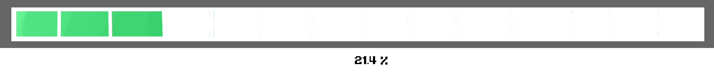

 
 

 [Requirements][req]     [Dance Moves][dance]   [About Us][about]   [Development][dev]   [Data Sheets][data]

  

  

  

# 
 [CG3002 AY17/18 Dance-Dance Project] 

## 
 Progress 

#### Objective: 

> Design a dance-tracker which detects the designated dance step listed below.

## Schedule

Week No. | Happening | Remarks
---|---|---
~1st Week~ | ~Lecture: Project Overview~ | Done
~2nd Week~ | ~Lecture: Introduction To Hardware Platform~ | Gone
~3rd Week~ | ~Lecture: Communication and Firmware~ | Poof
4th Week | Design Report & Lecture: System Architecture & Machine Learning Basics |
5th Week | Feedback on Design |
6th Week | Progress Checkpoint |
Recess Week | Rest? |
7th Week | Individual Components(hw,comms,sw) |
8th Week |  |
9th Week |  |
10th Week |  |
11th Week | Baseline Evaluation (5 Moves) |
12th Week | |
13th Week | Final Evaluation (All Moves) |
Reading Week |  |

[req]: https://github.com/cardboardcode/dancedance/blob/master/resources/docs/CG3002-dance.pdf

[dance]:https://github.com/cardboardcode/dancedance/blob/master/resources/dancemoves.md

[about]:https://github.com/cardboardcode/dancedance/blob/master/resources/about.md
[data]: https://github.com/cardboardcode/dancedance/blob/master/resources/data.md
[dev]:https://github.com/cardboardcode/dancedance/blob/master/resources/dev.md