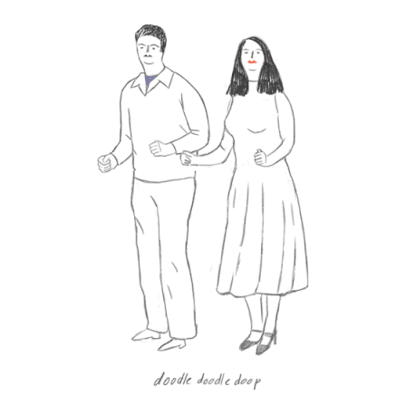
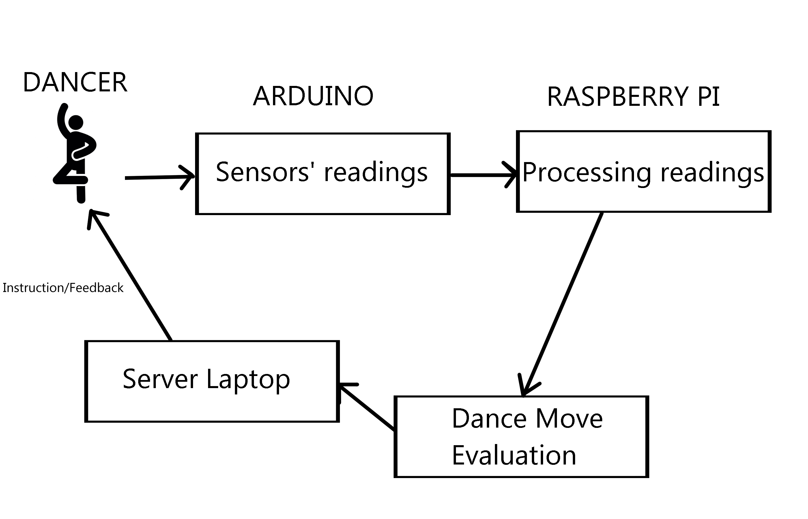

## Summary

* [Requirements][req]
* [Dance Moves][dance]
* [About Us][about]
* [Development][dev]
* [Data Sheets][data]
* [Past Schedule][schedule]

  

# 
 [CG3002 AY17/18 Dance-Dance Project] 

## 
 Progress 

#### Objective: 

> The wearable technology market has been growing from strength to strength, having the potential to emerge closely behind smartphones and tablets. Consumers utilize these wearables to keep track of their health, fitness and even as a form of fashion. 

> The project that we are embarking on aims to create a wearable device that is able to detect dance moves. 

#### System Functionalities

> 

> As seen in the above diagram, the system would first instruct the dancer to perform a specific dance move. Thereafter, the dancer would proceed to do the dance move instructed and the sensors, which are attached on the dancer, would gather data about the dancer’s movements. An Arduino system would be polling the data from the sensors and would send that data over to the Raspberry Pi to be processed. The data would be used to evaluate whether the dancer has performed the correct move. The outcome would be sent to the server laptop where it would feedback to the dancer if the correct move is performed.

> There are two main objectives of this project:

	1. The device that is worn by the dancer has to be able to compute and sense the dance moves automatically
	2. There are ten specific dance moves that have to be detected (with a personalized final move at the end).

[req]: https://github.com/cardboardcode/dancedance/blob/master/resources/docs/CG3002-dance.pdf

[dance]:https://github.com/cardboardcode/dancedance/blob/master/resources/dancemoves.md

[about]:https://github.com/cardboardcode/dancedance/blob/master/resources/about.md
[data]: https://github.com/cardboardcode/dancedance/blob/master/resources/data.md
[dev]:https://github.com/cardboardcode/dancedance/blob/master/resources/dev.md
[schedule]:https://github.com/cardboardcode/dancedance/blob/master/resources/schedule.md