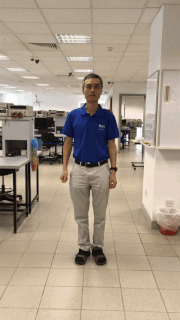

## Dance Moves

[return to Summary][return]

>    

Front-Back  |  HandWave   |  Jumping

>   

JumpingJack  |  Squat-Turn-Clap   |  Steering

>   

Turn-Clap  |  Windows   |  Windows360

[return]: https://github.com/cardboardcode/dancedance