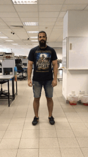
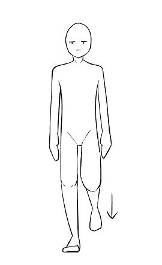
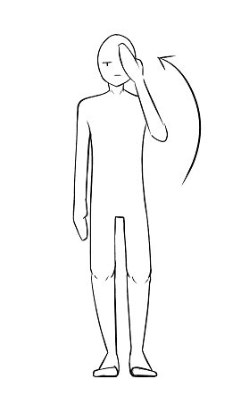
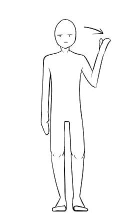

## Dance Moves

[Supersize it][supersize] [ Warning: Your browser will lag.]

[Return to Summary][return]

### BASICS

>     

1. Wavehand  |  2. Bus Driver   |  3. Front Back | 4. Side-Step | 5. Jumping

### ADVANCED

>     

6. Jumping Jack  |  7. Turn Clap   |  8. Squat Turn Clap | 9. Windows | 10. Windows 360

## FINAL MOVE

>   

Description: Stamp on the ground with your one leg twice and then gesture in such a way that means "I don't get it".

[return]: https://github.com/cardboardcode/dancedance
[supersize]: https://github.com/cardboardcode/dancedance/blob/master/resources/superdancemoves.md

