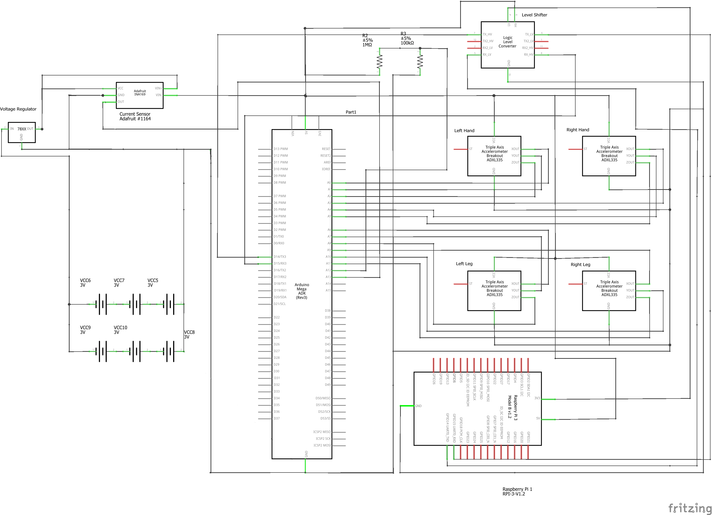

[Return to Summary][return]

## Description:

> This section details the developmental progress of the project, showcasing variantions as the team undergoes iterative prototyping. 

## Content
> [Overall System Architecture](#overall-system-architecture)
> [Circuit Diagram](#circuit-diagram)
> [Use Case Diagram](#use-case-diagram)
> [Visualisation](#visualisation)

# Overall System Architecture
 
> [Return to Top](#content)
# Circuit Diagram 
> [Return to Top](#content)

> [Return to Top](#content)
# Use Case Diagram

> [Return to Top](#content)
# Vizualisation

> [Return to Top](#content)

[return]: https://github.com/cardboardcode/dancedance